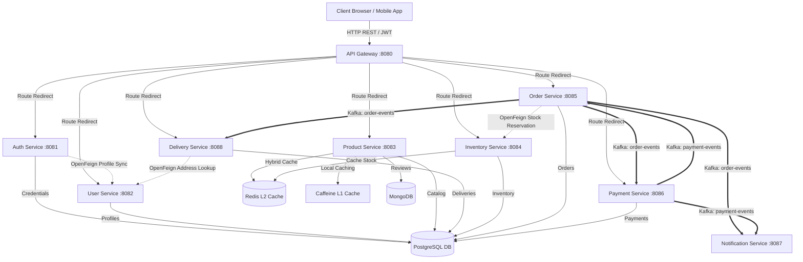

# LocalKart - Distributed Enterprise Commerce Platform

LocalKart is a production-grade, interview-quality Enterprise Commerce Platform built on a distributed microservices architecture using Java 21 and Spring Boot 3.x. The platform implements core distributed patterns, such as Saga Orchestration, polyglot databases (relational PostgreSQL + document MongoDB), high-performance hybrid caching (Caffeine L1 + Redis L2), event-driven choreography, and end-to-end delivery tracking.

---

## 1. System Architecture

The platform consists of ten services coordinating via synchronous REST calls (OpenFeign) and asynchronous event-driven messages (Apache Kafka):



---

## 2. Platform Component Map & Service Directory

### 2.1 Component Table
| Service Name | Port | Database | Caching Layer | Description |
| :--- | :---: | :--- | :--- | :--- |
| **API Gateway** | `8080` | None | None | Central ingress router handling routing, path rewrites, JWT verification, and downstream identity propagation. |
| **Auth Service** | `8081` | PostgreSQL (`localkart_auth`) | None | Manages user registration, credential hashing, and JWT token issuance. |
| **User Service** | `8082` | PostgreSQL (`localkart_user`) | None | Manages customer profiles (emails, names, phone numbers, shipping addresses). |
| **Product Service**| `8083` | Relational + NoSQL (`localkart_product` + MongoDB) | Hybrid L1 (Caffeine) + L2 (Redis) | Serves the product catalog. Integrates MongoDB for reviews and logs, and Caffeine + Redis to buffer catalog hits. Exposes GraphQL query schemas. |
| **Inventory Service**|`8084` | PostgreSQL (`localkart_inventory`)| Redis Cache | Tracks catalog stock levels by SKU. Handles transactional reservation checkouts. |
| **Order Service** | `8085` | PostgreSQL (`localkart_order`) | None | Checkout saga orchestrator. Persists order records, coordinates feign checkouts, and emits order events. |
| **Payment Service** | `8086` | PostgreSQL (`localkart_payment`) | None | Simulates credit-card transactions, logging payment logs and publishing confirmations. |
| **Notification Service**|`8087`| None | None | Consumer service executing email/SMS dispatches from order and payment event streams. |
| **Delivery Service** | `8088` | PostgreSQL (`localkart_delivery`) | None | Tracks delivery lifecycle from order payment through shipment to final delivery. Auto-creates tracking entries from Kafka events. |
| **Shared Library** | N/A | N/A | N/A | Holds reusable response envelopes, filter security interceptors, aspects, utilities, and global exception advice. |

### 2.2 How the Services Work & Individual Responsibilities

#### 🔑 Auth Service (`auth-service`)
* **Role**: Primary identity manager.
* **Database**: Runs on PostgreSQL (`localkart_auth` schema) holding user login credentials. Passwords are encrypted securely using BCrypt hashes.
* **Flows**: 
  1. On registration (`POST /api/v1/auth/register`), it hashes the password, persists credentials, and triggers a synchronous **OpenFeign** REST call to `user-service` to create an empty customer profile associated with the new credentials.
  2. On login (`POST /api/v1/auth/login`), it verifies the credentials and returns a secure JWT containing the user's role and email claims.

#### 👤 User Service (`user-service`)
* **Role**: Stores demographic customer records.
* **Database**: Runs on PostgreSQL (`localkart_user` schema).
* **Flows**: 
  * Exposes endpoints to retrieve and edit user profile entities (name, shipping address, contact number).
  * Direct downstream services verify permissions by cross-referencing identities injected into the `SecurityContext` by the gateway headers.

#### 📦 Product Service (`product-service`)
* **Role**: Catalog manager and search engine.
* **Database**: Polyglot database architecture. Catalog items are persisted in PostgreSQL (`localkart_product` schema), whereas user ratings and feedback comments are stored inside **MongoDB** (`localkart_product` collection) as documents for document flexibility.
* **Caching**: Features high-performance hybrid caching. Reads look in Caffeine (L1 local JVM cache) first. On a local miss, the query falls back to Redis (L2 distributed cache). On a Redis miss, it reads the databases, updating both caching layers. Writes evict caches to avoid state sync drift.
* **GraphQL**: Exposes a standard REST catalog API, alongside a GraphQL endpoint (`/graphql`) allowing clients to retrieve tailored catalog attributes in a single request.

#### 🏭 Inventory Service (`inventory-service`)
* **Role**: Handles warehouse stock reservations.
* **Database**: Runs on PostgreSQL (`localkart_inventory` schema) mapping quantities to product SKU keys.
* **Flows**: 
  * Features two transactional endpoints: `/reserve` (decrements SKU quantity and locks inventory) and `/release` (restores inventory).
  * Invoked synchronously during the checkout transaction saga.

#### 🛒 Order Service (`order-service`)
* **Role**: Coordinates the checkout Saga transaction lifecycle.
* **Database**: Runs on PostgreSQL (`localkart_order` schema).
* **Flows**: 
  * Initiates orders as `CREATED`.
  * Invokes `inventory-service` using Feign clients. If any item is out of stock, it executes compensating `/release` requests for already-processed items and transitions the order to `CANCELLED`.
  * If stock reservation succeeds, it publishes an `ORDER_CREATED` event to Kafka.
  * Listens on Kafka topic `payment-events` for payment responses. On payment success, updates the order to `PAID`. On failure, triggers inventory releases and cancels the order.

#### 💳 Payment Service (`payment-service`)
* **Role**: Simulates standard billing gates.
* **Database**: Runs on PostgreSQL (`localkart_payment` schema).
* **Flows**:
  * Consumes `ORDER_CREATED` events from the Kafka `order-events` topic.
  * Processes billing simulator calls, logs the transaction, and publishes a `PaymentEvent` (with `SUCCESS`/`FAILED` status) to `payment-events`.

#### 🔔 Notification Service (`notification-service`)
* **Role**: Dispatches platform alerts to users.
* **Flows**:
  * Consumes message streams from both `order-events` and `payment-events` topics.
  * Simulates sending emails/SMS alerts (e.g. order confirmation, payment receipt, cancellation warnings) based on event states.

#### 🚚 Delivery Service (`delivery-service`)
* **Role**: End-to-end delivery lifecycle manager.
* **Database**: Runs on PostgreSQL (`localkart_delivery` schema).
* **Flows**:
  * Consumes `ORDER_PAID` events from the Kafka `order-events` topic to auto-initialize delivery tracking with a generated tracking number.
  * Consumes `ORDER_CANCELLED` events to auto-cancel pending deliveries.
  * Fetches the user's shipping address dynamically via **OpenFeign** call to `user-service` (with graceful fallback to default address).
  * Tracks delivery statuses through the lifecycle: `PENDING` → `ASSIGNED` → `SHIPPED` → `DELIVERED` (or `CANCELLED`).
  * Exposes REST endpoints for manual delivery creation, status updates, and tracking queries.
  * Uses typed `DeliveryStatus` enum for status management, with full `@Valid` input validation on DTOs.

#### 🛡️ Shared Library (`shared-library`)
* **Role**: Commons jar package.
* **Responsibilities**:
  * Implements `ApiResponseWrapper` to structure microservice responses uniformly.
  * Provides `HeaderAuthenticationFilter` which parses gateway identity headers (`X-Auth-User`, `X-Auth-Roles`) and constructs Spring Security `Authentication` states inside downstream services.
  * Implements the servlet `CorrelationIdFilter` to bind tracing headers to Logback MDC contexts.

---

---

## 3. Core Distributed Design Patterns

### 3.1 Distributed Saga Orchestration (Checkout Pipeline)
When a checkout request (`POST /api/v1/orders`) is submitted:
1. **Order Creation**: The **Order Service** saves a new order with `CREATED` status.
2. **Synchronous Reservation**: The service loops through items, making synchronous Feign calls to **Inventory Service** (`POST /api/v1/inventory/reserve`).
3. **Saga Compensating Rollback**: If any SKU reservation fails (due to insufficient stock), the Order Service catches the error and executes compensating releases (`POST /api/v1/inventory/release`) for all previously reserved items in the loop, rolling back the database transaction.
4. **Asynchronous Payment Trigger**: If all reservations succeed, the Order Service publishes an `ORDER_CREATED` event to the `order-events` Kafka topic.
5. **Transaction Processing**: The **Payment Service** consumes the event, simulates billing, saves the log, and publishes a `PaymentEvent` to the `payment-events` topic.
6. **Saga Conclusion**: The Order Service consumes the payment result:
   - If payment `SUCCESS`: status transitions to `PAID`.
   - If payment `FAILED`: status transitions to `CANCELLED`, and a compensating Feign call triggers stock releases in **Inventory Service**.

### 3.2 Security Context & Identity Propagation
1. The **API Gateway** intercepts incoming REST requests, decodes/validates JWTs, extracts user emails/roles, and injects them as downstream headers (`X-Auth-User` and `X-Auth-Roles`).
2. Internal microservices register the custom shared filter **HeaderAuthenticationFilter**. This filter extracts the headers and builds standard Spring Security `Authentication` tokens directly inside the thread-local `SecurityContextHolder`.
3. Resource controllers retrieve authenticated identities cleanly using `SecurityContextUtils.getUsername()`.

### 3.3 Hybrid High-Performance Caching (Product Catalog)
To maximize query performance:
- **L1 Cache (Local Caffeine)**: Local in-memory cache providing sub-millisecond retrieval of product information directly on the application instance.
- **L2 Cache (Distributed Redis)**: Shared cache server protecting the primary SQL database.
- **Cache Synchronization**: Read requests query Caffeine first. On local miss, they query Redis. On Redis miss, they hit the SQL database and write back to L2 and L1. Catalog edits trigger `@CacheEvict` updates to ensure consistency.

---

## 4. Setup & Launch Guide

### 4.1 Prerequisites
Ensure you have the following installed:
* **Java 21** or later
* **Maven 3.9+**
* **Docker & Docker Compose**

### 4.2 Automated Platform Orchestration (One-Command Startup)
We provide custom orchestration scripts at the workspace root to compile, launch, and tear down the entire distributed environment (including databases, caching services, event brokers, and all 9 Java microservices) with a single command:

#### 🚀 Start the Platform
To compile the codebase, start all relational and NoSQL databases, verify port health, and boot the entire platform in the background, simply run:
```bash
./start-platform.sh
```
This single utility automates:
1. Compiling and packaging Java binaries via `mvn package -DskipTests`.
2. Provisioning databases and event brokers inside Docker:
   - **PostgreSQL** (`5432`): Binds ports and creates all relational schemas (`localkart_auth`, `localkart_user`, etc.) automatically on startup.
   - **MongoDB** (`27017`): Unauthenticated instance for rating documents storage.
   - **Redis** (`6379`): Key-value memory cache.
   - **Zookeeper** (`2181`) & **Kafka** (`9092`): Event streaming infrastructure.
3. Conducting active TCP checks to ensure the database ports are open before triggering downstream services.
4. Launching 9 Java microservices sequentially in the background, saving their execution process IDs and redirecting logs to `./logs/<service-name>.log`.
5. Running actuator health checks (`/actuator/health`) against each launched service to verify it is `UP` and accepting requests before proceeding to the next service.

#### 📊 Monitor Log Outputs
To monitor the platform and tail logs from all services simultaneously, run:
```bash
tail -f logs/*.log
```
Or tail a specific service log, e.g. `tail -f logs/order-service.log`.

#### 🛑 Stop the Platform
To tear down the platform, stop all background processes, and shut down the Docker infrastructure containers cleanly, run:
```bash
./stop-platform.sh
```

---

## 5. Testing & Verification

The platform includes comprehensive unit tests, reactive WebFilter stubs, and end-to-end integration tests verifying cross-service communications.

To run the entire test suite:
```bash
mvn clean test
```

### Key Integration & Filter Tests
* **`GatewayCorrelationFilterTests`**: Verifies reactive UUID correlation injection, downstream headers mutation, and upstream response attributes binding.
* **`GatewayRateLimitingFilterTests`**: Verifies in-memory token-bucket depletion logic, IP-based isolation, and HTTP `429 TOO_MANY_REQUESTS` status with a `Retry-After: 5` header.
* **`GatewayAccessLogFilterTests`**: Verifies non-blocking execution logging and routing latency recording.
* **`CheckoutSagaIntegrationTests`**: Verifies full Saga orchestration logic (MockMvc request, SQL saving, Feign stubs, Payment consumer triggers, and status updates).
* **`UserRegistrationIntegrationTests`**: Verifies credential hashing in H2 database and Feign client profile creation.

---

## 6. Custom Platform Extensions

LocalKart is configured with custom-built enterprise extensions to keep the stack entirely free, lightweight, and open-source.

### 6.1 Custom Distributed Trace Propagation & Logging
To trace requests across microservice boundaries without paid APM tools, the platform features a zero-cost distributed tracing layout:
* **API Gateway Ingress**: `GatewayCorrelationFilter` (WebFlux) checks for an incoming `X-Correlation-ID` header. If absent, it generates a fresh UUID. It binds this ID to the exchange attributes and propagates it downstream by mutating request headers and upstream by writing to response headers.
* **Access Diagnostic Logs**: `GatewayAccessLogFilter` measures routing latency and prints diagnostic access summaries:
  `[API Gateway] Access Log: Method=POST Path=/api/v1/orders Status=201 Latency=48ms CorrelationID=f2a34b67-...`
* **Service Interception**: Downstream services load a servlet `CorrelationIdFilter` from the shared library which binds the incoming `X-Correlation-ID` header to the Logback MDC (Mapped Diagnostic Context). Logs automatically capture the active correlation ID.

### 6.2 Custom Reactive Rate Limiting
To protect endpoints from abuse, the API Gateway implements an in-memory token-bucket rate limiter:
* **Filter Class**: `GatewayRateLimitingFilter`
* **Partitioning**: Grouped and isolated per client IP Address (`getHostAddress()`).
* **Parameters**:
  * **Bucket Capacity**: `100` tokens.
  * **Refill Rate**: `2.0` tokens/second.
* **Shedding behavior**: Exceeding the rate limit triggers an immediate HTTP `429 TOO_MANY_REQUESTS` error containing a `Retry-After: 5` header.
* **Memory Safety**: Includes a scheduled eviction task that runs every 5 minutes, removing token buckets for IP addresses inactive for more than 10 minutes. This prevents unbounded memory growth from unique client IPs.

### 6.3 Zookeeper Volume Persistence & Tuning
The development environment configures custom Apache Zookeeper features inside [docker-compose.yml](file:///Users/deepawasthi/Developer/LocalKart/infrastructure/docker-compose.yml):
* **Persistent Mounts**: Binds Zookeeper's transaction logs and data directories locally to prevent state loss across container restarts.
* **Connection Tuning**: Sets `ZOOKEEPER_MAX_CLIENT_CONNECTIONS` to `60` to accommodate multiple concurrent service nodes.
* **Utility Health Checker**: A custom [zookeeper-check.sh](file:///Users/deepawasthi/Developer/LocalKart/infrastructure/zookeeper-check.sh) script queries Zookeeper's diagnostic port (`2181`) using the `ruok` and `stat` netcat (`nc`) commands to evaluate client connection loads.

### 6.4 Zero-Cost Google Analytics Dashboard
The Gateway serves a responsive static status dashboard at `/` (defined in [index.html](file:///Users/deepawasthi/Developer/LocalKart/api-gateway/src/main/resources/static/index.html)).
* **Aesthetics**: Sleek modern dark mode UI utilizing HSL gradients, glassmorphism, responsive grids, and micro-animations on hover.
* **Analytics**: Embeds a standard Google Analytics v4 tracking snippet tag (`G-LKART2026`) to record dashboard visits and diagnostic actions at zero cost.

---

## 7. Interactive API Testing (`requests.http`)

To facilitate rapid, local-first API interactions, a `requests.http` template has been added to the root directory and every microservice:
* **Root Workspace**: [requests.http](file:///Users/deepawasthi/Developer/LocalKart/requests.http)
* **API Gateway**: [api-gateway/requests.http](file:///Users/deepawasthi/Developer/LocalKart/api-gateway/requests.http)
* **Auth Service**: [auth-service/requests.http](file:///Users/deepawasthi/Developer/LocalKart/auth-service/requests.http)
* **User Service**: [user-service/requests.http](file:///Users/deepawasthi/Developer/LocalKart/user-service/requests.http)
* **Product Service**: [product-service/requests.http](file:///Users/deepawasthi/Developer/LocalKart/product-service/requests.http)
* **Inventory Service**: [inventory-service/requests.http](file:///Users/deepawasthi/Developer/LocalKart/inventory-service/requests.http)
* **Order Service**: [order-service/requests.http](file:///Users/deepawasthi/Developer/LocalKart/order-service/requests.http)
* **Payment Service**: [payment-service/requests.http](file:///Users/deepawasthi/Developer/LocalKart/payment-service/requests.http)
* **Notification Service**: [notification-service/requests.http](file:///Users/deepawasthi/Developer/LocalKart/notification-service/requests.http) _(health/metrics only — event-driven service)_
* **Delivery Service**: [delivery-service/requests.http](file:///Users/deepawasthi/Developer/LocalKart/delivery-service/requests.http)

Using IntelliJ HTTP Client or the VSCode REST Client extension, you can execute these requests directly from the IDE to perform registration, login, stock checkouts, payment simulations, delivery tracking, and GraphQL queries.
